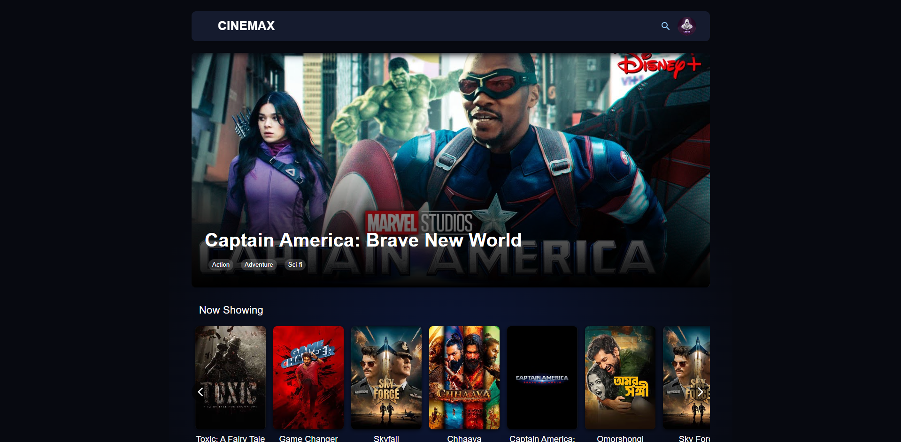

# Cinemax - Online Movie Ticket Booking System

Welcome to Cinemax! A feature-rich online movie ticket booking system built using the MERN stack, designed to provide a seamless booking experience for users.

## Preview



## Contributors  

- [Niladri Chakraborty](https://github.com/nil-official)  
- [Deep Adhikary](https://github.com/DAdhikary06)
- Prasam Kundu
- [Kaustabh Basu](https://github.com/axon04)

## Table of Contents

- [Introduction](#introduction)
- [Features](#features)
- [Technologies Used](#technologies-used)
- [Installation](#installation)
- [Usage](#usage)
- [Contributing](#contributing)
- [License](#license)

## Introduction

Cinemax is an intuitive and efficient online movie ticket booking platform, designed for single halls. Users can browse currently available movies, select their preferred showtimes, choose seats, and book tickets effortlessly. This repository contains the full-stack implementation of the system, including both frontend and backend code.

## Features

- User authentication and authorization with **Google OAuth(2.0)**
- Movie listings with search
- Showtimes and screen selection
- Interactive seat selection with real-time availability updates
- Secure payment integration with **Razorpay**
- Booking history and **QR e-ticket generation**
- Admin panel for managing movies, screens, and bookings
- Seat Layout editor for screens in Admin panel
- Responsive design for both mobile and desktop

## Technologies Used

- **MongoDB**: NoSQL database for storing movie, user, and booking data
- **Express.js**: Backend framework for handling API requests
- **React**: Frontend library for creating a dynamic UI
- **Node.js**: JavaScript runtime for the backend
- **Redux**: State management for efficient data handling
- **React Router**: Routing library for seamless navigation
- **Material UI**: Utility-first CSS framework for responsive design
- **Razorpay**: Secure payment processing

## Installation

To get started with Cinemax, follow these steps:

### Backend Setup

1. **Clone the repository:**
    ```bash
    git clone https://github.com/axon04/Cinemax.git
    cd cinemax
    ```

2. **Install backend dependencies:**
    ```bash
    cd backend
    npm install
    ```

3. **Set up environment variables:** Create a `.env` file in the `backend` directory and add your MongoDB connection string, secret keys, and other necessary environment variables.

4. **Start the backend server:**
    ```bash
    npm run dev
    ```

The backend will run on `http://localhost:5000`.

### Frontend Setup

1. **Navigate to the frontend directory:**
    ```bash
    cd ../frontend
    ```

2. **Install frontend dependencies:**
    ```bash
    npm install
    ```

3. **Start the development server:**
    ```bash
    npm start
    ```

The application will be available at `http://localhost:5173`.

## Usage

Once the development servers are running, users can:
- Browse movies and showtimes
- Select seats and make bookings
- View booking history and download e-tickets
- Admins can manage movies, theaters, and bookings via the admin panel

## Contributing

We welcome contributions to Cinemax! If you have any ideas, suggestions, or bug reports, please open an issue or submit a pull request.

### Steps to Contribute:

1. **Fork the repository**
2. **Create a new branch:**
    ```bash
    git checkout -b feature/your-feature-name
    ```
3. **Make your changes**
4. **Commit your changes:**
    ```bash
    git commit -m 'Add some feature'
    ```
5. **Push to the branch:**
    ```bash
    git push origin feature/your-feature-name
    ```
6. **Open a pull request**

## License

This project is licensed under the MIT License. See the [LICENSE](LICENSE) file for more details.

Thank you for using Cinemax! Enjoy your movie experience!